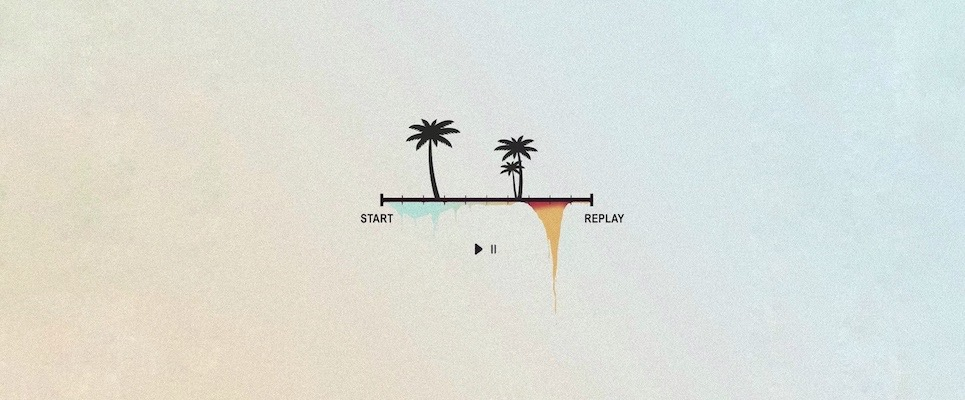

# Data-Structures-And-Algorithms

<p align="center" >
  
</p>

<p align="center">
<a href="https://code.visualstudio.com/"></a>
<a href="http://www.open-std.org/jtc1/sc22/wg14/"></a>
<a href="https://github.com/"></a>
<a href="https://opensource.org/licenses/MIT"></a>
<a href="https://gitmoji.dev"></a>
<a href="https://github.com/Andy0570/Data-Structures-And-Algorithms/commits"></a>
</p>


## 参考

* [《数据结构与算法基础》教学视频 @青岛大学 - 王卓](https://www.bilibili.com/read/cv3285768?spm_id_from=333.999.0.0)
* Mark Allen Weiss. 数据结构与算法分析 C 语言描述（第 2 版） [M]. 机械工业出版社，2019


## 安装

```
// ...
```


## 使用

```
// ...
```


## 如何贡献

欢迎任何贡献，有关如何参与到本项目的信息，请参见 [CONTRIBUTING](./CONTRIBUTING.md)。


## 统计信息


## 使用许可

本项目基于 [MIT](https://opensource.org/licenses/MIT) 许可协议，详情请参见 [LICENSE](./LICENSE)。